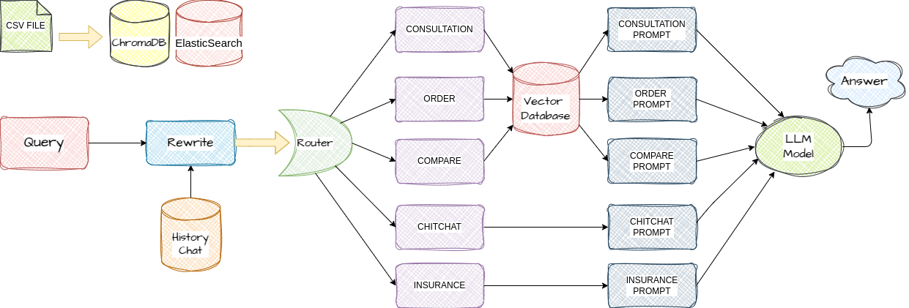
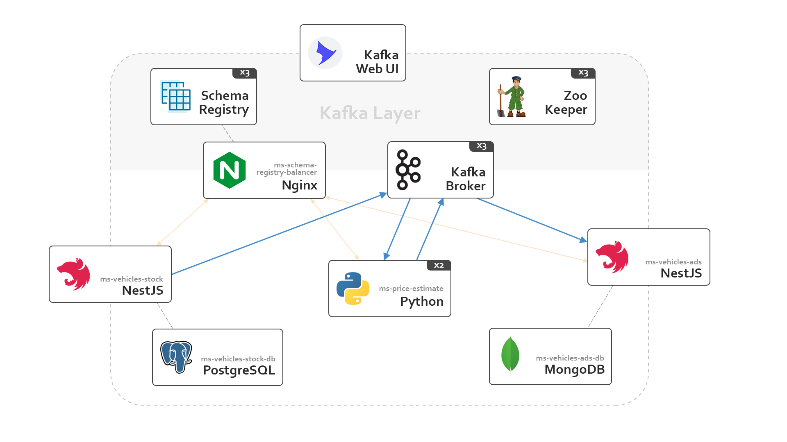

# Introdution 

🚀 ICN Lab | Passionate Developers & Researchers

👋 Hello everyone! We are a group of passionate developers and researchers this is project is by Tran Van Huy and  members of ICN Lab under the guidance of Assoc. Prof. Hoang Trong Minh.

🛠️ Technologies We Work With:

Backend: NestJS, PostgreSQL, MongoDB, Sequelize ORM
Frontend: Next.js, React.js
Data Engineering: Airflow, Kafka, Spark, Cassandra
📡 Research & Projects
🔬 Scientific Research: Application of drones in surveillance, smart agriculture, and urban traffic management. Our research focuses on IoT, signal processing, and AI in these fields.

🤖 Machine Learning for Everyone: A project introducing beginners to Machine Learning, covering fundamental concepts, data preprocessing, model building, and real-world applications.

🔥 If you find my projects interesting, feel free to check them out and drop a ⭐ to show your support!

```bash
🔗 GitLab: gitlab.com/tvh25082004
🔗 GitHub: github.com/tranhuy25
```

Thank you so much! 😊


# Description Project

🛍️ Online Shopping Website | E-Commerce Platform
👋 Welcome to Online Shopping Website, an e-commerce platform that makes shopping easy, fast, and convenient. We offer a wide range of products, from fashion, electronics, home appliances, beauty to modern technology gadgets, all at affordable prices with exciting discounts.

🚀 Key Features
```bash
✅ User-friendly and easy-to-use interface
✅ Smart product search and filtering system
✅ Fast and highly secure payment process
✅ Multiple payment methods (Momo, ZaloPay, Bank Transfer, COD)
✅ Order tracking and real-time status updates
✅ Weekly discounts and special promotions
✅ 24/7 customer support
✅ ChatBot 🚀 in progress
```

🛠️ Technologies Used
Backend: NestJS, PostgreSQL, MongoDB, Sequelize ORM
Frontend: Next.js, React.js


## 2. Installation Process 
🛠️ Step-by-Step Guide: Deploying NestJS (Server) & Next.js (Client)

1️⃣ Set Up the Environment
Install Node.js and Yarn (or npm):

# Install Node.js (if not installed)
curl -fsSL https://deb.nodesource.com/setup_18.x | sudo -E bash -
sudo apt install -y nodejs

# Check the version
```bash
node -v
npm -v
```

### 2.1. System Requirements
- **Docker**: Install Docker ([guide](https://docs.docker.com/get-docker/)).
- **Git**: To clone the source code.
- **Node.js**: Version >= 16.x ([download here](https://nodejs.org/)).
- **Python**: Version >= 3.x ([download here](https://www.python.org/)).

### 2.2. Installation

#### Step 1: Clone the repository
```bash
git clone https://github.com/website-proj/quanlisieuthibanle.git
cd quanlisieuthibanle
```

#### Step 2: Configure the `.env` file
Create a `.env` file in the root directory and add the following environment variables:
```env
# Database Configuration
DB_HOST=<YOUR_HOST>
DB_PORT=5432
DB_NAME=<DATABASE_NAME>
DB_USER=<USERNAME>
DB_PASSWORD=<PASSWORD>

# Application Configuration
APP_PORT=3000
```

#### Step 3: Start the backend system
```bash
cd server
npm install
npm run start:dev
```
or you want to use docker

```bash
docker-compose up -d
```

The above command will start all Docker containers, including the backend and database.

#### Step 4: Start the frontend
Navigate to the frontend directory and start it:
```bash
cd client
npm install
npm run dev
```
After running, the frontend will be accessible at: `http://localhost:3000`.

---

## 3. User Guide

### 3.1. Access the web interface
- Open a browser and visit: `http://localhost:3000`.
- Log in with the provided account.

### 3.3. API Integration
- API Documentation: [API Documentation](https://documenter.getpostman.com/view/39199721/2sAYQXpZ9D).
- Use Postman or a similar tool for integration.

---

## 4. Troubleshooting

### 4.1. Database connection error
- Check that the `.env` file contains the correct information.
- Ensure that port 5432 is open.

### 4.2. Container fails to start
- Check Docker logs:
```bash
docker-compose logs
```
- Fix the error based on the log message.

---

## 5. References
- Docker Documentation: [Docker Documentation](https://docs.docker.com/).
- GitHub Repository: [Project Repository](https://github.com/website-proj/quanlisieuthibanle).







- And now watch the demo video and enjoy our work.


